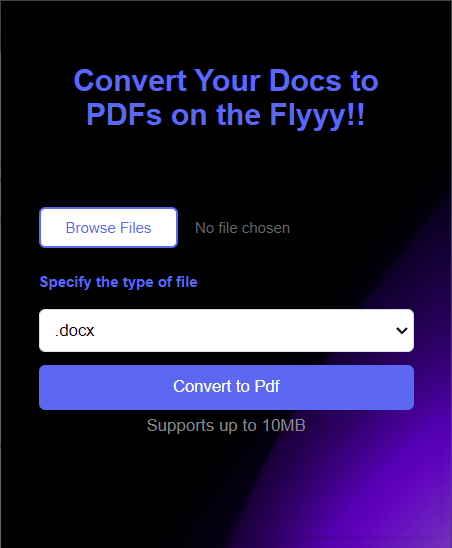
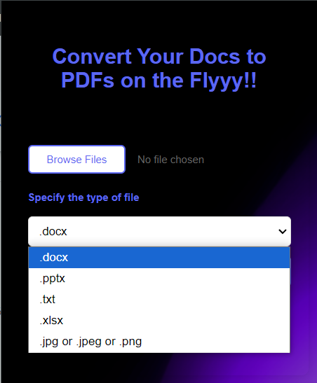
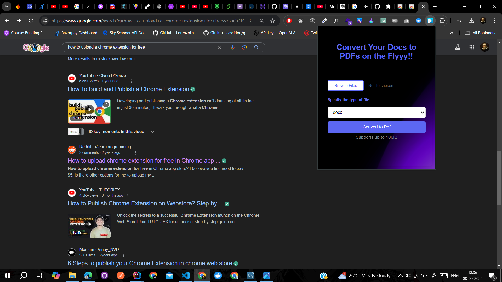

# DocHouse

**DocHouse** is a Chrome extension built using Spring Boot for backend services and HTML, CSS, and JavaScript for the frontend. It allows users to convert various file types (e.g., `.ppt`, `.txt`, `.xlsx`, `.doc`, `.jpg`, and more) into PDFs.

## Features
- Convert a wide range of file types to PDFs
- Drag-and-drop file upload interface
- Fast conversion with support for multiple formats
- Clean and efficient UI

## Tech Stack
- **Frontend**: HTML, CSS, JavaScript
- **Backend**: Spring Boot, Maven
- **Libraries/Tools**: Apache POI, iTextPDF, Thumbnailator

## Installation
1. Download the extension from the [Chrome Web Store](#).
2. Click on the extension icon to open DocHouse.

## Usage
1. Click the DocHouse icon.
2. Upload your files.
3. Click "Convert" to generate PDFs instantly.

## Screenshots

Here are a few screenshots of the **DocHouse** Chrome extension in action:

### 1. UI of Dochouse

### 2. Supported file formats

### 3. Chrome view

## Contributing
Contributions are welcome! Feel free to open an issue or create a pull request.
